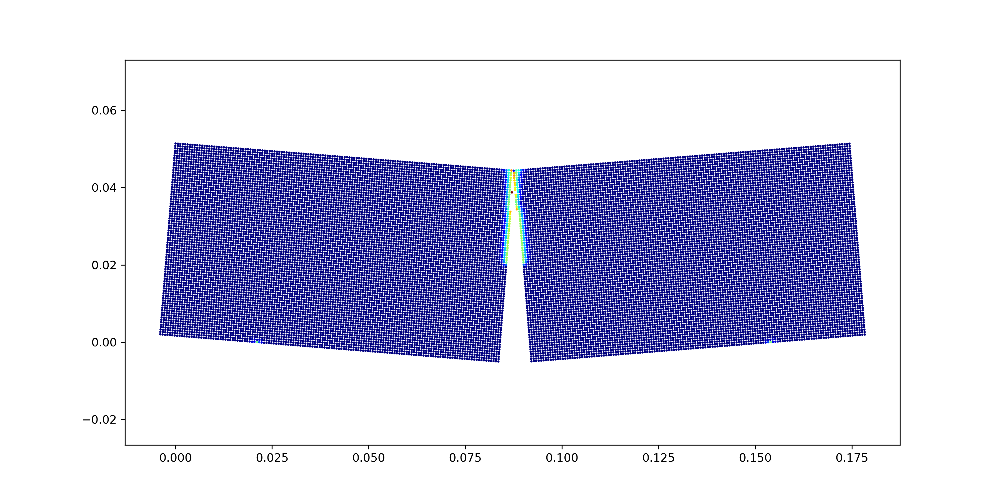

# PyPD

A simple bond-based peridynamics code written in Python

PyPD provides an easy to use class structure with fully interchangeable integration schemes and material models (constitutive model)

## Code structure

## Dependencies

## Getting started

Make sure you have Pipenv installed on your system. If you don't have it, you can install it using pip:

```shell
$ pip install pipenv
```

Pipenv provides a convenient way to manage Python package dependencies and virtual environments. By following these steps, you'll be able to install and work with the package in a controlled and isolated environment.

Clone the repository:

```shell
$ git clone git@github.com:mark-hobbs/PyPD.git
```

Change into the cloned repository's directory:

```shell
$ cd PyPD/
```

Create a virtual environment and install the package dependencies using Pipenv:

```shell
$ pipenv install --dev
```

This command will create a new virtual environment and install the package dependencies, including both the required dependencies and any development dependencies specified in the Pipfile.

Activate the virtual environment:

```shell
$ pipenv shell
```

This command will activate the virtual environment so that you can work within it.

You are now ready to use the package. You can run the package's scripts, import its modules, or use any other functionality it provides.

## Usage

## Features

## Examples

There are multiple examples provided:

- [Crack branching in notched Homalite sheets](/examples/2D_notch.py)
- [Plate with a hole in tension](/examples/2D_plate.py)
- [Three-point bending test of a half-notched concrete beam](/examples/2D_B4_HN.py)
- [Nuclear graphite ring compression test  ](/examples/2D_graphite_ring.py)
- [Mixed-mode fracture in concrete](/examples/2D_mixed_mode.py)

### Crack branching

```
python -m examples.2D_notch.py
```


### Flexural three-point bending test - half-notched beam

```
python -m examples.2D_B4_HN.py
```



## :white_check_mark: TODO

- [ ] Write unit tests
- [ ] Write documentation
- [ ] Publish on PyPI
- [ ] `feature/space-filling-curve` - sort particles spatially to improve memory access (see this [notebook](https://github.com/pdebuyl/compute/blob/master/hilbert_curve/hilbert_curve.ipynb) on understanding the Hilbert curve)
- [x] `feature/animation` - add native capabilities to generate animations
- [ ] GPU acceleration (see this [notebook](https://github.com/lukepolson/youtube_channel/blob/main/Python%20GPU/multibody_boltzmann.ipynb) where `pytorch` is used to speed up particle simulations)